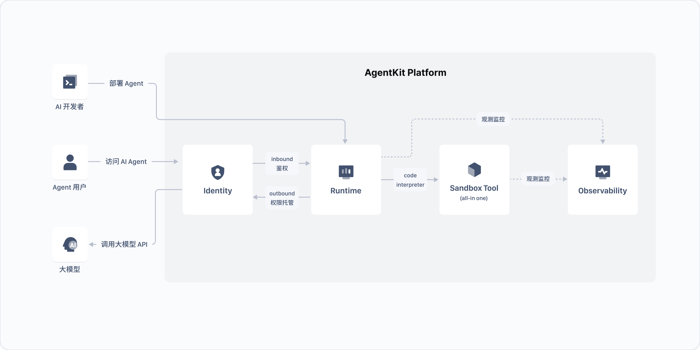
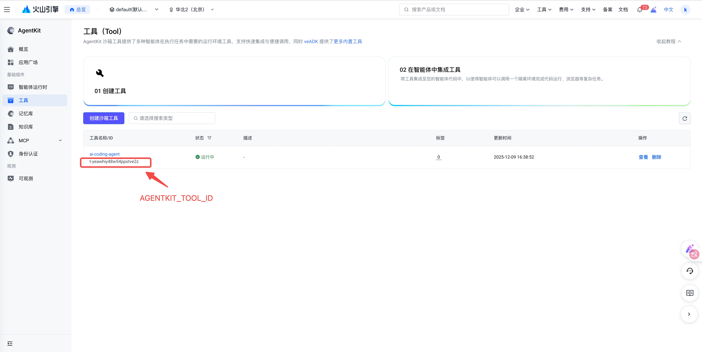

# AI Coding Agent - 智能编程助手

这是一个基于火山引擎AgentKit构建的智能编程助手系统，专门用于帮助用户解决各类编程问题。系统集成了代码执行沙箱、TOS对象存储服务功能，能够提供专业、高效的编程辅助体验。

## 概述

本用例展示如何构建一个生产级 AI 编程助手系统，具备以下能力:

- **智能编程对话**：基于AI的智能编程助手，能够理解用户编程需求并提供准确代码解决方案
- **代码执行验证**：在沙箱环境中执行代码，验证代码的正确性和运行效果
- **前端代码托管**：自动将前端代码（HTML/CSS/JS）上传至TOS对象存储，并生成可访问的预览链接
- **多语言支持**：支持Python、Java、JavaScript、Go等多种编程语言
- **长期记忆**：支持会话记忆和用户历史记录存储
- **观测能力**：集成OpenTelemetry追踪和APMPlus监控

## 核心功能



```text
用户请求
    ↓
AgentKit 运行时
    ↓
AI 编程助手
    ├── 代码执行工具 (run_code)
    ├── TOS 上传工具 (upload_frontend_code_to_tos)
    └── URL 生成工具 (get_url_of_frontend_code_in_tos)
```

## Agent 能力

| 组件 | 描述 |
| - | - |
| **Agent 服务** | [`agent.py`](agent.py) - 主智能体应用,包含配置和运行逻辑 |
| **工具模块** | [`tools.py`](tools.py) - TOS 上传、URL 生成和实用工具函数 |
| **沙箱执行** | 支持 Python、Java、JavaScript、Go 的安全代码执行环境 |
| **TOS 集成** | 用于托管前端代码并提供公共访问的对象存储服务 |

### 多语言支持

支持 Python、Java、JavaScript、Go 等主流编程语言,具备自动语法验证。

### 沙箱执行

在隔离环境中运行代码,确保安全性并防止系统干扰。

### 自动化部署

前端代码自动上传到 TOS,生成预览 URL 以便立即测试。

### 可观测性

内置 OpenTelemetry 追踪和 APMPlus 监控,支持生产环境调试和性能分析。

## 目录结构说明

```text
ai_coding/
├── agent.py              # 主智能体应用及配置
├── tools.py              # 工具函数 (TOS 上传、URL 生成)
├── requirements.txt      # Python 依赖
└── README.md            # 项目文档
```

## 本地运行

### 前置条件

#### 火山引擎访问凭证

1. 登录 [火山引擎控制台](https://console.volcengine.com)
2. 进入"访问控制" → "用户" -> 新建用户 或 搜索已有用户名 -> 点击用户名进入"用户详情" -> 进入"密钥" -> 新建密钥 或 复制已有的 AK/SK
   - 如下图所示
   
3. 为用户配置 AgentKit运行所依赖服务的访问权限:
   - 在"用户详情"页面 -> 进入"权限" -> 点击"添加权限"，将以下策略授权给用户
   - `AgentKitFullAccess`（AgentKit 全量权限）
   - `APMPlusServerFullAccess`（APMPlus 全量权限）
4. 为用户获取火山方舟模型 Agent API Key
   - 登陆[火山方舟控制台](https://console.volcengine.com/ark/region:ark+cn-beijing/overview?briefPage=0&briefType=introduce&type=new)
   - 进入"API Key管理" -> 创建 或 复制已有的 API Key，后续`MODEL_AGENT_API_KEY`环境变量需要配置为该值
   - 如下图所示
   
5. 开通模型预置推理接入点
   - 登陆[火山方舟控制台](https://console.volcengine.com/ark/region:ark+cn-beijing/overview?briefPage=0&briefType=introduce&type=new)
   - 进入"开通管理" -> "语言模型" -> 找到相应模型 -> 点击"开通服务"
   - 确认开通，等待服务生效（通常1-2分钟）
   - 开通本案例中使用到的以下模型
        - `deepseek-v4-pro-260425`
        - `doubao-seed-code-preview-251028`
   - 如下图所示
   

#### AgentKit 工具 ID

1. 登录火山引擎 AgentKit 控制台
2. 进入"工具" → "创建沙箱工具"
3. 创建工具:
   - 工具名称: `ai-coding-agent`
   - 描述: AI 编程助手工具
4. 复制生成的工具 ID 用于配置（后续`AGENTKIT_TOOL_ID`环境变量需要配置为该值）, 如下图所示
   

### 安装依赖

*推荐使用uv工具build项目**

```bash
# install uv
curl -LsSf https://astral.sh/uv/install.sh | sh

cd python/02-use-cases/ai_coding

# create virtual environment
uv venv --python 3.12

# activate virtual environment
source .venv/bin/activate

# install necessary dependencies
uv pip install -r requirements.txt
```

### 配置环境变量

设置以下环境变量:

```bash
export VOLCENGINE_ACCESS_KEY={your_ak}
export VOLCENGINE_SECRET_KEY={your_sk}
export DATABASE_TOS_BUCKET={your_tos_bucket}
export AGENTKIT_TOOL_ID={your_tool_id}
export MODEL_AGENT_API_KEY={your_model_agent_api_key}
```

**环境变量说明:**

- `VOLCENGINE_ACCESS_KEY`: 火山引擎访问凭证的 Access Key
- `VOLCENGINE_SECRET_KEY`: 火山引擎访问凭证的 Secret Key
- `DATABASE_TOS_BUCKET`: 用于存储生成的前端代码的 TOS 存储桶名称
  - 格式: `DATABASE_TOS_BUCKET={your_tos_bucket}`
  - 示例: `DATABASE_TOS_BUCKET=agentkit-platform-12345678901234567890`
- `AGENTKIT_TOOL_ID`: 从 AgentKit 控制台获取的工具 ID
- `MODEL_AGENT_API_KEY`: 从火山方舟获取的模型 Agent API Key

> 如何创建 TOS桶 [参考](https://www.volcengine.com/docs/6349/75024?lang=zh)

## 本地运行

使用 `veadk web` 进行本地调试:

> `veadk web`是一个基于 FastAPI 的 Web 服务，用于调试 Agent 应用。运行该命令时，会启动一个web服务器，这个服务器会加载并运行您的 agentkit 智能体代码，同时提供一个聊天界面，您可以在聊天界面与智能体进行交互。在界面的侧边栏或特定面板中，您可以查看智能体运行的细节，包括思考过程（Thought Process）、工具调用（Tool calls）、模型输入/输出。

```bash
# 1. 进入上级目录
cd 02-use-cases

# 2. 启动 Web 界面
veadk web
```

服务默认运行在 8000 端口。访问 `http://127.0.0.1:8000`,选择 `ai_coding` 智能体,开始测试。

### 示例提示词

- **前端代码生成**: "请帮我用 JavaScript 写一个防抖函数"
- **Python 代码生成**: "写一个生成斐波那契数列的函数"
- **算法实现**: "用 Python 创建一个二分查找实现"

## AgentKit 部署

1. 部署到火山引擎 AgentKit Runtime:

```bash
# 1. 进入项目目录
cd python/02-use-cases/ai_coding

# 2. 配置 agentkit
agentkit config \
--agent_name ai_coding \
--entry_point 'agent.py' \
--runtime_envs DATABASE_TOS_BUCKET={your_tos_bucket} \
--runtime_envs AGENTKIT_TOOL_ID={your_tool_id} \
--launch_type cloud

# 3. 部署到运行时
agentkit launch
```

1. 调用智能体

```bash
agentkit invoke '{"prompt": "用 Python 创建一个二分查找实现"}'
```

## 常见问题

**错误: `DATABASE_TOS_BUCKET not set`**

- 需通过环境变量设置用于代码上传的 TOS 存储桶名称

**代码执行超时：**

- 检查沙箱服务状态和网络连接
- 验证代码复杂度和执行时间要求

**TOS 上传失败：**

- 确认 Access Key/Secret Key 具有 TOS 写入权限
- 验证存储桶名称和区域配置

## 效果展示

AI Coding 效果。

## 常见问题

无。

## 🔗 相关资源

- [AgentKit 官方文档](https://www.volcengine.com/docs/86681/1844878?lang=zh)
- [TOS 对象存储](https://www.volcengine.com/product/TOS)
- [AgentKit 应用广场](https://console.volcengine.com/agentkit/region:agentkit+cn-beijing/application)
- [AgentKit 控制台](https://console.volcengine.com/agentkit/region:agentkit+cn-beijing/overview?projectName=default)

## 代码许可

本工程遵循 Apache 2.0 License
