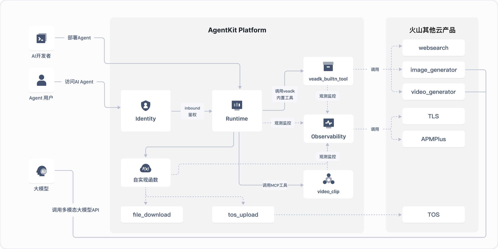
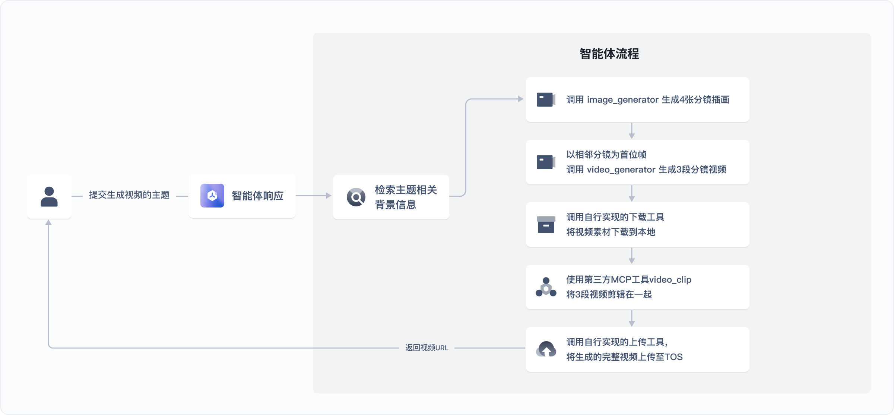
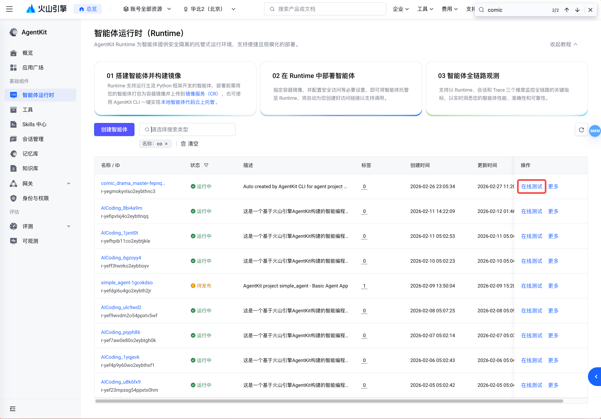
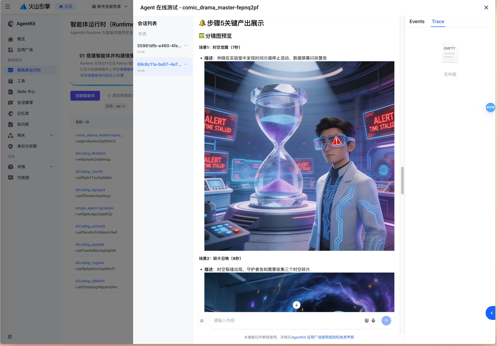

# 漫剧生成器 (Comic Drama Generator)

[English](README_en.md) | 中文

基于火山引擎 AgentKit 的 AI 漫剧制作 Agent。输入一个故事创意，自动完成剧本创作、角色设计、分镜图生成、分镜视频生成、视频合成全流程，最终交付完整漫剧视频和 TOS 链接。

<p align="center">
  
</p>

## 核心功能

- **全流程自动化**：8 步流水线，从创意到成片，无需手动干预
- **智能时长分配**：每个分镜场景 4~15 秒动态分配，节奏生动自然
- **专业镜头语言**：内置导演级运镜策略（速度斜坡、360° 环绕、跟拍追踪等）
- **内容安全预审**：自动评估风险等级，主动处理敏感内容
- **画风一致性**：STYLE_ANCHOR 贯穿全流程，角色提示词严格复用
- **产物完整验证**：每步交付后自动检查文件完整性 + AI 效果评分
- **多题材支持**：神话、武侠、修仙、都市、科幻、儿童等 10+ 题材
- **MCP 工具集成**：通过 `@pickstar-2002/video-clip-mcp` 提供视频剪辑能力
- **断点续制**：中断后可从已完成步骤继续，无需重新开始
- **批量图片并行生成**：角色立绘和分镜图支持并行生成，大幅提升效率
- **失败自动重试**：场景生成失败时自动进行多次重试，提升成功率

## 制作流程

```
用户故事创意
  ↓
步骤1: 读取配置 → 智能时长模式（4s~15s 动态范围）
步骤2: 初始化任务目录 → 按 COMIC_DRAMA_OUTPUT_DIR 创建独立目录
  ↓ ⚠️ 内容安全预审
步骤3: 剧本生成 → byted-web-search 调研 + 创作剧本 + 时长分配
步骤4: 角色设计 → image-generate 生成立绘（并行）
步骤5: 场景美术 → image-generate 生成分镜图（并行）
步骤6: 分镜视频 → batch_video.py submit/poll（独立时长）
步骤7: 视频合成 → ffmpeg 合并 + TOS 上传
步骤8: 产物验证与效果评分
  ↓
完整漫剧视频 + TOS 签名链接 + 评分报告
```

<p align="center">
  
</p>

## 系统架构

```text
用户请求
    ↓
AgentKit Runtime
    ↓
漫剧制作大师 (comic_drama_master)
    ├── Skill: comic-drama-master  → 8 步全流程编排
    ├── 图片生成工具 (image_generate / batch_image_generate)
    ├── 视频生成工具 (create_video_task / batch_video)
    ├── 文件下载工具 (file_download)
    ├── 视频合并工具 (video_merge + MCP video-clip)
    ├── TOS 上传工具 (tos_upload)
    ├── 网络搜索工具 (web_search)
    ├── 任务管理工具 (task_manager)
    ├── 产物验证工具 (verify_task)
    └── AI 效果评分工具 (video_scorer)
```

## 快速开始

### 前置条件

#### 火山引擎访问凭证

1. 登录 [火山引擎控制台](https://console.volcengine.com)
2. 进入「访问控制」→「用户」→ 新建用户 → 进入「密钥」→ 新建密钥，获取 AK/SK
3. 进入 [火山方舟控制台](https://console.volcengine.com/ark) →「API Key 管理」→ 创建 API Key
4. 开通以下模型的预置推理接入点：
   - Agent 模型：`deepseek-v3-2-251201`
   - 生图模型：`doubao-seedream-5-0-260128`
   - 生视频模型：`doubao-seedance-1-5-pro-251215`

#### Node.js 环境

- 安装 Node.js 18+ 和 npm（[Node.js 安装指南](https://nodejs.org/en)）
- 确保终端可以使用 `npx` 命令
- MCP 视频剪辑工具 (`@pickstar-2002/video-clip-mcp`) 在 Agent 运行时通过 `npx` 自动启动，无需手动安装

#### TOS 存储桶

创建一个 TOS 存储桶用于存放生成的视频文件，参考 [TOS 创建桶文档](https://www.volcengine.com/docs/6349/75024)。

### 安装依赖

```bash
cd 02-use-cases/comic_drama_gen

# 使用 uv 安装依赖
uv sync --index-url https://pypi.tuna.tsinghua.edu.cn/simple

# 激活虚拟环境
source .venv/bin/activate
```

### 配置环境变量

支持两种方式配置环境变量：

#### 方式一：`.env` 文件（推荐）

在 `comic_drama_gen/` 目录下创建 `.env` 文件：

```bash
VOLCENGINE_ACCESS_KEY=your_ak
VOLCENGINE_SECRET_KEY=your_sk
ARK_API_KEY=your_ark_api_key
DATABASE_TOS_BUCKET=your_tos_bucket_name

# 可选
COMIC_DRAMA_OUTPUT_DIR=./my-comic-drama
VIDEO_DURATION_MINUTES=0.5
DEFAULT_VIDEO_MODEL_NAME=doubao-seedance-1-5-pro-251215
```

> `.env` 文件会在启动时自动加载（通过 `python-dotenv` 或内置解析器），不会覆盖已导出的环境变量。

#### 方式二：直接 export

```bash
# 必须设置
export VOLCENGINE_ACCESS_KEY=your_ak
export VOLCENGINE_SECRET_KEY=your_sk
export ARK_API_KEY=your_ark_api_key

# TOS 存储桶（用于上传生成视频）
export DATABASE_TOS_BUCKET=your_tos_bucket_name

# 可选
export COMIC_DRAMA_OUTPUT_DIR=./my-comic-drama
export VIDEO_DURATION_MINUTES=0.5
export DEFAULT_VIDEO_MODEL_NAME=doubao-seedance-1-5-pro-251215
```

**环境变量说明：**

| 变量 | 必填 | 默认值 | 说明 |
|------|------|--------|------|
| `VOLCENGINE_ACCESS_KEY` | ✅ | — | 火山引擎访问凭证 AK |
| `VOLCENGINE_SECRET_KEY` | ✅ | — | 火山引擎访问凭证 SK |
| `ARK_API_KEY` | ✅ | — | 火山方舟 API Key |
| `DATABASE_TOS_BUCKET` | ✅ | — | TOS 存储桶名称 |
| `COMIC_DRAMA_OUTPUT_DIR` | ❌ | 项目目录下的 `output/` | 产物输出根目录 |
| `VIDEO_DURATION_MINUTES` | ❌ | `0.5` | 视频时长（分钟），支持 0.5/1/2/3/4（0.5 = 30 秒）|
| `DEFAULT_VIDEO_MODEL_NAME` | ❌ | `doubao-seedance-1-5-pro-251215` | 视频生成模型名称 |

### 本地运行

#### 方法 1：使用 veadk web（推荐调试）

```bash
# 在 02-use-cases/ 目录下运行
cd 02-use-cases
veadk web --port 8082
```

在浏览器中访问 `http://localhost:8082`，选择 `comic_drama_master` 智能体，输入故事创意并发送。

#### 方法 2：直接 API 调用

```bash
# 进入项目目录，直接运行
cd 02-use-cases/comic_drama_gen
uv run agent.py
# 服务默认监听 0.0.0.0:8000
```

**创建会话：**
```bash
curl -X POST 'http://localhost:8000/apps/comic_drama_master/users/u_123/sessions/s_1' \
  -H 'Content-Type: application/json'
```

**发送消息：**
```bash
curl 'http://localhost:8000/run_sse' \
  -H 'Content-Type: application/json' \
  -d '{
    "appName": "comic_drama_master",
    "userId": "u_123",
    "sessionId": "s_1",
    "newMessage": {
      "role": "user",
      "parts": [{"text": "孙悟空大战二郎神，国漫3D写实风格"}]
    },
    "streaming": true
  }'
```

### 示例提示词

| 题材 | 示例提示词 |
|------|-----------|
| 中国神话 | `孙悟空大战二郎神，国漫3D写实风格` |
| 武侠 | `射雕英雄传，郭靖大战欧阳锋，真人版` |
| 修仙 | `凡人修仙传韩立结婴，视频时长2分钟` |
| 历史 | `荆轲刺秦王最后一夜` |
| 都市 | `职场风云：实习生逆袭大厂CEO，日漫2D风格` |
| 科幻 | `星际特工拯救地球` |
| 儿童 | `小狐狸寻找星星碎片` |

## 目录结构

```
comic_drama_gen/
├── agent.py                # Agent 入口（MCP 工具注册、skill 加载、会话存储）
├── agent.yaml              # Agent 配置（模型、系统指令）
├── agentkit.yaml           # AgentKit 云端部署配置
├── consts.py               # 默认常量 + .env 自动加载
├── config.py               # 公共配置常量（BASE_URL、路径、环境变量）
├── .env                    # 环境变量配置文件（需自行创建）
├── Dockerfile              # Docker 部署文件（AgentKit 自动生成）
├── pyproject.toml          # Python 项目配置
├── requirements.txt        # 依赖清单
├── run_tests.py            # 16 场景自动化测试（顺序执行，支持断点续跑）
├── run_retry.py            # 失败场景重试脚本
├── run_group.py            # 按分组批量生成（读取 comic_prompts_30.json）
├── batch_generate.py       # 全量批量生成器（30 部漫剧，3 组，每组生成报告）
├── runner_utils.py         # 测试公用工具函数（SSE 发送、续接判断、服务重启）
├── comic_prompts_30.json   # 30 个多题材预置提示词（按 group 1/2/3 分组）
├── scripts/                # 辅助脚本目录
│   └── setup.sh            # 云端部署构建脚本（预装 video-clip-mcp）
├── img/                    # README 引用的图片资源
│   ├── archtecture_video_gen.jpg
│   └── process_video_gen.jpg
├── resource/               # 静态资源
└── skill/comic-drama-master/
    ├── SKILL.md             # 总导演技能说明（8 步全流程）
    ├── examples/
    │   └── examples.md      # 完整使用示例
    ├── references/
    │   ├── character-designer.md     # 角色设计规格
    │   ├── scene-designer.md         # 场景美术规格
    │   ├── screenplay-generator.md   # 剧本生成规格
    │   ├── storyboard-director.md    # 分镜导演规格
    │   └── video-synthesizer.md      # 视频合成规格
    └── scripts/
        ├── app_config.py         # 读取视频时长配置
        ├── task_manager.py       # 任务目录管理（FIFO 清理，最多 16 个任务）
        ├── batch_video.py        # 批量视频任务提交/轮询
        ├── batch_image_generate.py  # 批量图片并行生成
        ├── create_video_task.py  # 单个视频任务创建
        ├── query_video_task.py   # 视频任务状态查询
        ├── image_generate.py     # 图片生成（base64 直接保存）
        ├── web_search.py         # 网络搜索（剧本调研用）
        ├── video_merge.py        # ffmpeg 视频合并
        ├── video_scorer.py       # AI 效果评分（5 维度）
        ├── verify_task.py        # 产物完整性验证
        ├── tos_upload.py         # TOS 上传
        ├── file_download.py      # 批量文件下载
        └── get_aksk.py           # AK/SK 凭证获取
```

## 产物目录结构

每个任务完成后，`COMIC_DRAMA_OUTPUT_DIR`（默认为项目目录下的 `output/`）下会有如下结构：

```
{COMIC_DRAMA_OUTPUT_DIR}/
└── task_20260222_143000_孙悟空大战二郎神/
    ├── requirements.md   # 需求文档（含 web_search 调研摘要）
    ├── plot.md           # 章节式剧情大纲（含智能时长分配）
    ├── script.md         # 完整对白剧本（含逐秒时间戳 + 每章独立时长）
    ├── characters.md     # 角色设计（含 STYLE_ANCHOR + 英文提示词 + 立绘图片）
    ├── cover.jpg         # 封面图
    ├── cover.md          # 封面信息
    ├── final_video.md    # 最终交付文档（含 TOS 链接）
    ├── storyboard/       # 分镜图（scene_01.jpg ~ scene_NN.jpg）
    ├── characters/       # 角色立绘（char_*.jpg）
    ├── videos/           # 分镜视频（scene_01.mp4 ~ scene_NN.mp4，智能时长 4~15s）
    └── final/            # 合成漫剧（*_final.mp4）
```

## 测试

项目内置了多种自动化测试和批量生成脚本：

```bash
# 顺序执行 16 个多题材场景测试（赛博朋克、水墨玄幻、言情穿越、科幻等）
uv run python run_tests.py [start_index]

# 失败场景重试（从指定序号继续）
uv run python run_retry.py [start_index]

# 按分组批量生成（读取 comic_prompts_30.json，指定 group 1/2/3）
uv run python run_group.py <group_id>

# 全量批量生成 30 部漫剧（分 3 组，每组完成后自动生成报告）
uv run python batch_generate.py              # 运行全部 3 组
uv run python batch_generate.py --group 2   # 仅运行第 2 组
```

所有脚本均会自动启动/重启服务、创建会话、发送生成请求，并在 SSE 连接中断时自动发送续接消息，直到最终视频生成完成。`batch_generate.py` 额外支持每组生成 Markdown 格式的进度报告（`report_group_N.md`）。

## AgentKit 部署

### 部署到火山引擎 AgentKit Runtime

```bash
cd 02-use-cases/comic_drama_gen

agentkit config \
  --agent_name comic_drama_master \
  --entry_point 'agent.py' \
  --runtime_envs DATABASE_TOS_BUCKET=your_bucket_name \
  --launch_type cloud

agentkit launch
```

### Docker 部署

项目包含自动生成的 `Dockerfile`，也可手动构建：

```bash
cd 02-use-cases/comic_drama_gen
docker build -t comic-drama-gen .
docker run -p 8000:8000 \
  -e VOLCENGINE_ACCESS_KEY=your_ak \
  -e VOLCENGINE_SECRET_KEY=your_sk \
  -e ARK_API_KEY=your_api_key \
  -e DATABASE_TOS_BUCKET=your_bucket \
  comic-drama-gen
```

### 测试已部署的智能体

1. 访问 [火山引擎 AgentKit 控制台](https://console.volcengine.com/agentkit)
2. 点击 **Runtime** 查看已部署的智能体 `comic_drama_master`
3. 获取公网访问域名和 API Key，即可通过 API 调用

#### 页面调试

AgentKit 智能体列表页面提供了调试入口，点击后可以在可视化 UI 中调试智能体功能。





#### 命令行调试

可以直接使用 `agentkit invoke` 发起调试：

```bash
agentkit invoke '{"prompt": "孙悟空大战二郎神，国漫3D写实风格"}'
```

#### API 调试

**创建会话：**

```bash
curl --location --request POST 'https://xxxxx.apigateway-cn-beijing.volceapi.com/apps/comic_drama_master/users/u_123/sessions/s_124' \
--header 'Content-Type: application/json' \
--header 'Authorization: <your_api_key>' \
--data ''
```

**发送消息：**

```bash
curl --location 'https://xxxxx.apigateway-cn-beijing.volceapi.com/run_sse' \
--header 'Authorization: <your_api_key>' \
--header 'Content-Type: application/json' \
--data '{
    "appName": "comic_drama_master",
    "userId": "u_123",
    "sessionId": "s_124",
    "newMessage": {
        "role": "user",
        "parts": [{
            "text": "孙悟空大战二郎神，国漫3D写实风格"
        }]
    },
    "streaming": true
}'
```

## 常见问题

**视频生成任务失败（`OutputVideoSensitiveContentDetected`）：**
- 题材含武侠/战争/暴力元素时，Agent 会自动使用委婉替代词
- 若反复失败，可在提示词中明确要求「使用温和表达方式」

**`uv sync` 失败：**
- 确保已安装 Python 3.12+
- 尝试使用镜像：`uv sync --index-url https://pypi.tuna.tsinghua.edu.cn/simple --refresh`

**TOS 上传失败：**
- 确认 `VOLCENGINE_ACCESS_KEY`、`VOLCENGINE_SECRET_KEY` 和 `DATABASE_TOS_BUCKET` 均已正确设置
- 验证账户具有 TOS 存储桶读写权限

**任务目录过多：**
- `task_manager.py` 自动保留最新 16 个任务（FIFO 清理策略）
- 可通过 `COMIC_DRAMA_OUTPUT_DIR` 环境变量指定不同目录分隔测试和生产产物

**`.env` 文件不生效：**
- 确认 `.env` 文件位于 `comic_drama_gen/` 目录下
- `.env` 不会覆盖已通过 `export` 设置的环境变量
- 可安装 `python-dotenv` 获得更好的兼容性，否则使用内置解析器

**`npx` 命令未找到：**
- 安装 Node.js 18+ 和 npm
- 在终端中验证 `npx --version` 能否正常运行

**MCP 工具连接失败：**
- 确保默认 MCP 端口没有冲突
- 检查 Node.js 进程日志获取详细错误信息

## 🔗 相关资源

- [AgentKit 官方文档](https://www.volcengine.com/docs/86681/1844878)
- [火山方舟控制台](https://console.volcengine.com/ark)
- [TOS 对象存储](https://www.volcengine.com/product/TOS)
- [AgentKit 控制台](https://console.volcengine.com/agentkit)

## 代码许可

本工程遵循 Apache 2.0 License
