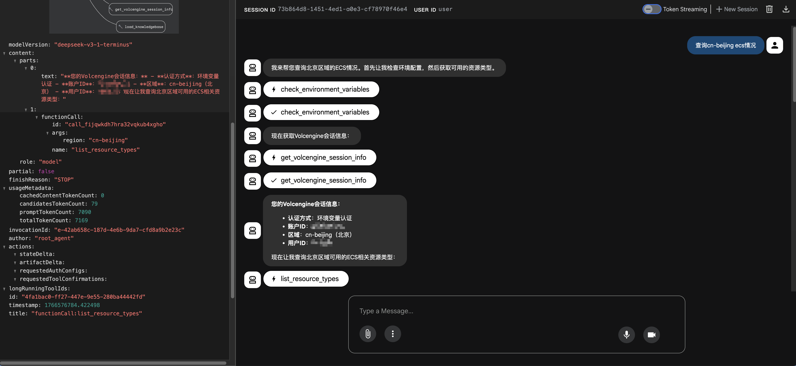
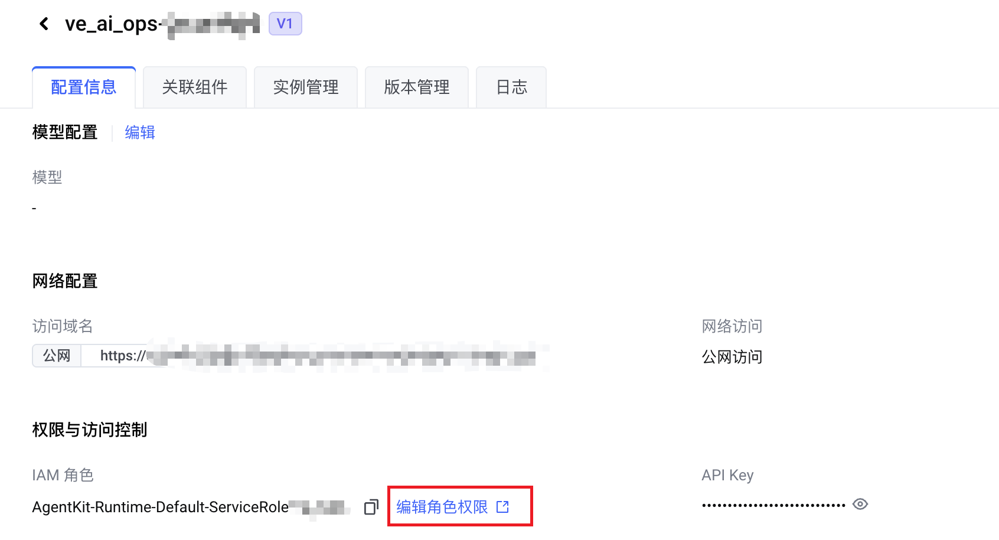
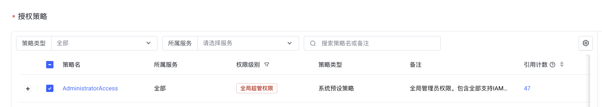
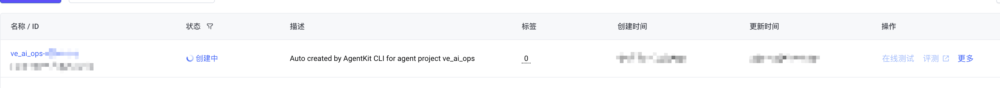
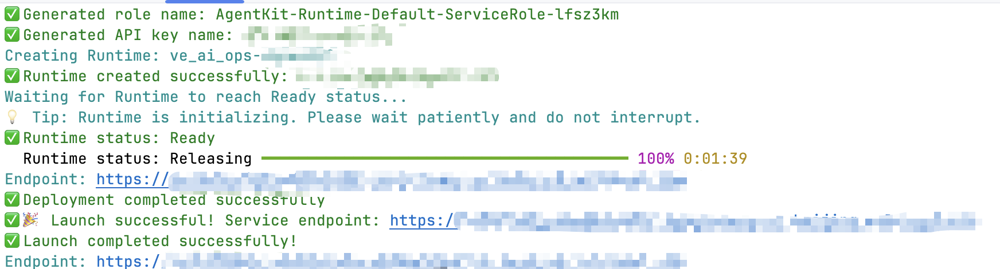
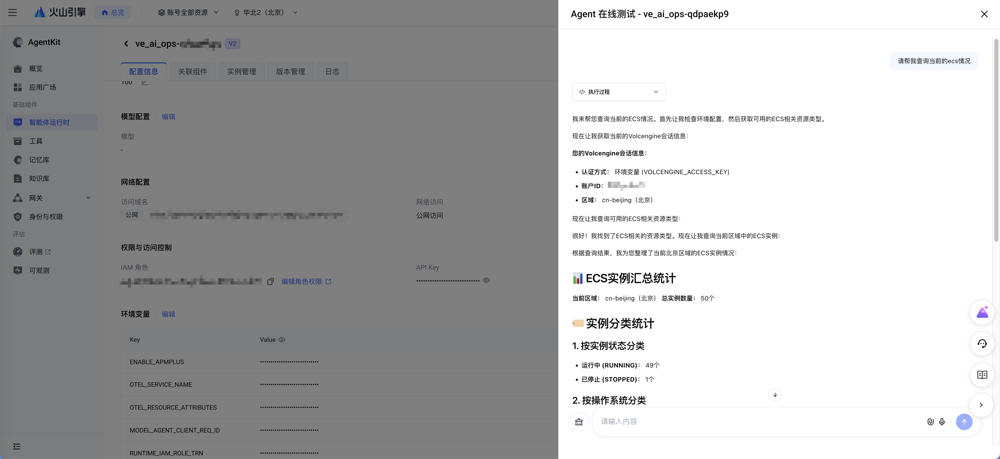

# AI运维 Agent - Mini AIOps

## 概述

> 本项目基于Veadk开发，实现了一个基于AI的运维智能工具

## 核心功能

本项目提供以下核心功能：

- 智能云资源巡检：自动梳理云上资源运行状态，发现潜在风险
- 一键问题诊断：结合日志、监控和主机诊断能力给出故障原因分析
- 运维知识问答：基于内置知识库回答常见运维问题和 SOP 流程
- 多 Agent 协同：通过 CCAPI 等 MCP 工具自动执行部分运维操作
- 长短期记忆：结合会话记忆与长期记忆提供持续性的运维助手体验

## Agent 能力

本项目当前内置一个总控 Agent 和一个子 Agent：

- ve_ai_ops_agent：面向云计算运维场景的总控 Agent，负责理解用户需求并规划巡检、诊断和优化流程。
- ccapi_agent：专注云资源管控的子 Agent，通过 CCAPI MCP 工具集查看和调整云上资源配置。

## 本地运行

### 环境准备

开始前，请确保您的开发环境满足以下要求：

- Python 3.10 或更高版本
- VeADK 0.2.28 或更高版本
- 推荐使用 `uv` 进行依赖管理
- <a target="_blank" href="https://console.volcengine.com/ark/region:ark+cn-beijing/apiKey">获取火山方舟 API KEY</a>
- <a target="_blank" href="https://console.volcengine.com/iam/keymanage/">获取火山引擎 AK/SK</a>

### 快速入门

请按照以下步骤在本地部署和运行本项目。

#### 1. 下载代码并安装依赖

```bash
# 克隆代码仓库
git clone https://github.com/bytedance/agentkit-samples.git
cd python/02-use-cases/mini_aiops

# 安装项目依赖
uv sync --index-url https://pypi.tuna.tsinghua.edu.cn/simple
```

#### 2. 配置环境变量

```bash
export MODEL_AGENT_API_KEY="xxxxx"
export VOLCENGINE_ACCESS_KEY="xxxxxx"
export VOLCENGINE_SECRET_KEY="xxxxxx"
```

#### 4. 启动服务

1. 请先保证环境变量配置正确

2. 本地`veadk web`启动测试（注意：请保持在`agentkit-samples/python/02-use-cases`目录，并使用 `mini_aiops` 下的虚拟环境）

```bash
cd ..
mini_aiops/.venv/bin/veadk web
```

如果使用 `.env` 文件而不是 `export`，请注意 VeADK 只会读取启动目录下的 `.env`。从 `python/02-use-cases` 启动时，建议提前 `export` 环境变量，或将 `.env` 放到 `python/02-use-cases/.env`。

1. 进入服务url `http://127.0.0.1:8000`
2. 选择`mini_aiops`
3. 与Agent进行对话

#### 5. 测试服务



## 目录结构说明

```plaintext
mini_aiops/
├── agent.py        # AIOps Agent 定义
├── README.md       # 使用说明与功能介绍
├── requirements.txt# 依赖列表（基于 veadk-python）
├── pyproject.toml  # 项目配置（uv/构建配置）
├── sop_aiops.md    # 运维 SOP 文档（可导入到知识库）
├── img/            # README 中使用的示意截图
└── uv.lock         # uv 生成的锁定文件
```

## AgentKit 部署

### 前置条件

- 已安装 AgentKit CLI
- 已配置火山引擎账号，并准备好具有相关资源权限的 AK/SK
- 当前目录为 `python/02-use-cases/mini_aiops`
- 本示例中的 CCAPI MCP Server 以本地源码方式随项目提供，线上部署时需要使用预先配置好的 `Dockerfile.example`

### 快速部署

```bash
# 1. 进入 mini_aiops 项目目录
cd python/02-use-cases/mini_aiops

# 2. 激活基础环境
uv sync --python 3.12
source .venv/bin/activate

# 3. 配置火山引擎 AK/SK
export VOLCENGINE_ACCESS_KEY="xxxxxx"
export VOLCENGINE_SECRET_KEY="xxxxxx"

# 4. 执行 AgentKit 配置
agentkit config

# 5. 使用预先配置好的 Dockerfile
cp Dockerfile.example Dockerfile

# 6. 发起部署
agentkit launch
```

`agentkit config` 时请按控制台提示完成配置；其中环境变量配置步骤请填写真实且具有相关权限的 AK/SK。`agentkit launch` 可能因超时失败，可以重试。

部署过程完成后，由于运维 MCP 工具需要 ECS 相关权限，请前往控制台开通相关权限。

进入控制台



开通相关权限



## 示例提示词

以下是一些常用的提示词示例：

"创建IAM用户"
"查看现有的ECS实例"
"列出可用的资源类型"
"更新某个资源的配置"

## 效果展示

部署中，控制台界面

部署完成后，bash界面


线上测试成功


## 常见问题

常见问题列表待补充。

## 代码许可

本项目采用开源许可证，详情请参考项目根目录下的 LICENSE 文件。
