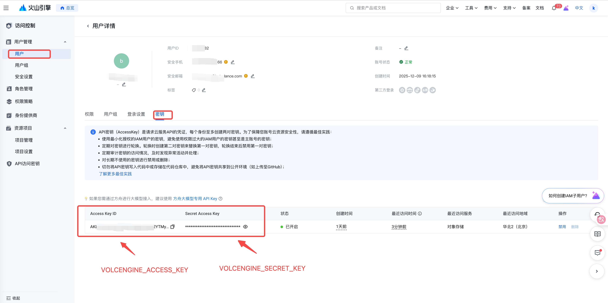
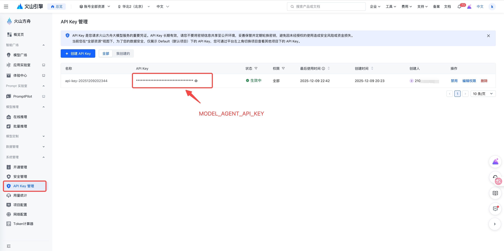
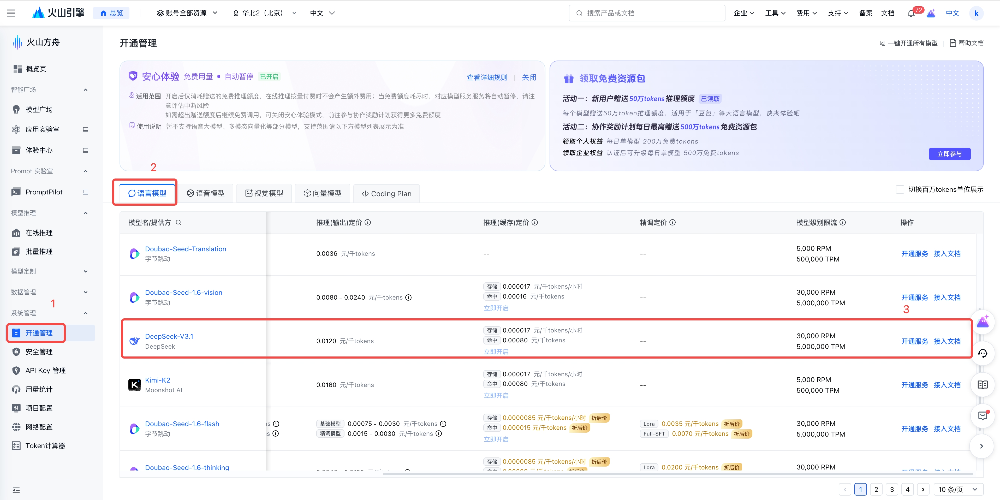
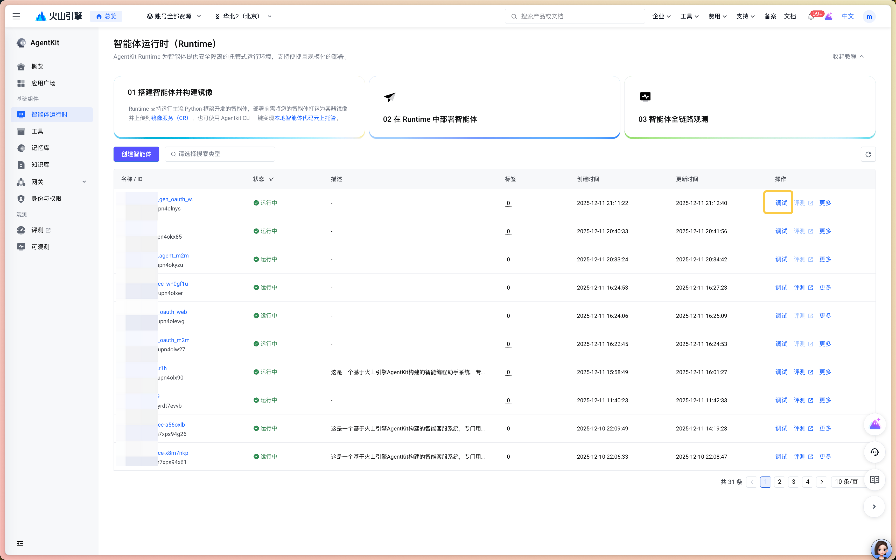

# 智能门店巡检系统

基于AgentKit的智能门店巡检助手，专门用于门店质量检测：招牌LED发光状态检测、洗手池整洁检测、货架陈列检测、工服穿着检测。系统能够自动识别异常情况，实现门店运营的标准化管理。

## 概述

本项目构建了一个AI驱动的门店质量检测解决方案，通过计算机视觉和人工智能技术，实现对门店各项设施状态的自动化巡检。系统能够智能识别招牌LED发光状态、洗手池整洁度、货架陈列规范等关键指标，并在发现异常时及时上报，帮助门店管理者快速响应和处理问题。

## 核心功能

### 🔍 智能图像处理与分析

- **精准目标检测**：自动识别门店招牌区域，智能框选完整招牌范围
- **智能图像剪裁**：自动提取招牌主体，去除无关背景干扰
- **文字智能识别**：准确检测招牌中的中英文文字
- **多模态图像理解**：通过视觉大模型深度理解图像内容，识别LED发光异常、货架/洗手池整洁度等问题

### 🤖 多智能体协同架构

- **Multi-Agent架构**：采用多智能体协同工作模式，自主判断最优任务执行流程
- **专业分工协作**：图像处理、异常分析各司其职，提升检测效率
- **端到端自动化**：从图像采集到告警通知的全流程自动化处理

## Agent 能力

主要的火山引擎产品或 Agent 组件：

- 大模型：
  - deepseek-v4-pro-260425
  - doubao-seed-2-0-pro-260215
- 自定义工具
- Identity
- APMPlus

## 目录结构说明

```bash
.
├── Dockerfile
├── README.md
├── __init__.py
├── agent.py   # Agent应用入口
├── agent.yaml # Agent配置文件（定义智能体核心特性、行为规则）
├── requirements.txt
└── tools      # 自定义工具
    ├── __init__.py
    ├── image  # 图片识别、图片检测工具
    │   ├── __init__.py
    │   ├── attire_inspection.py # 工人着装检查工具
    │   ├── image_cropper.py     # 图片裁剪工具
    │   ├── image_editor.py      # 图片标识画框工具
    │   ├── shelf_inspection.py  # 货架检测工具
    │   ├── signboard_inspection.py # 门店招牌检测工具
    │   └── sink_inspection.py      # 水池检测工具
    ├── model_auth.py   # 方舟大模型API_KEY置换工具
    └── tos_upload.py   # 火山TOS文件上传工具
```

## 快速开始

### 前置条件

**Python 版本：**

- Python 3.12 或更高版本

**火山引擎访问凭证：**

1. 登录 [火山引擎控制台](https://console.volcengine.com)
2. 进入"访问控制" → "用户" -> 新建用户 或 搜索已有用户名 -> 点击用户名进入"用户详情" -> 进入"密钥" -> 新建密钥 或 复制已有的 AK/SK
   - 记录 AK/SK，后续 `VOLCENGINE_ACCESS_KEY` 和 `VOLCENGINE_SECRET_KEY`环境变量需要配置为该值
   - 如下图所示
     
3. 为用户配置 AgentKit运行所依赖服务的访问权限:
   - 在"用户详情"页面 -> 进入"权限" -> 点击"添加权限"，将以下策略授权给用户
     - `AgentKitFullAccess`（AgentKit 全量权限）
     - `APMPlusServerFullAccess`（APMPlus 全量权限）
4. 为用户获取火山方舟模型 Agent API Key
   - 登陆[火山方舟控制台](https://console.volcengine.com/ark/region:ark+cn-beijing/overview?briefPage=0&briefType=introduce&type=new)
   - 进入"API Key管理" -> 创建 或 复制已有的 API Key，后续 `MODEL_AGENT_API_KEY`环境变量需要配置为该值
   - 如下图所示
     
5. 开通模型预置推理接入点
   - 登陆[火山方舟控制台](https://console.volcengine.com/ark/region:ark+cn-beijing/overview?briefPage=0&briefType=introduce&type=new)
   - 进入"开通管理" -> "语言模型" -> 找到相应模型 -> 点击"开通服务"
   - 确认开通，等待服务生效（通常1-2分钟）
   - 开通本案例中使用到的以下模型（您也可以根据实际需求开通其他模型的预置推理接入点，并在 `agent.py`代码中指定使用的模型）
     - `deepseek-v4-pro-260425`
     - `doubao-seed-2-0-pro-260215`
   - 如下图所示
     

### 安装依赖

```bash
pip install -r requirements.txt
```

### 配置环境变量

设置以下环境变量:

```bash
export VOLCENGINE_ACCESS_KEY={your_ak}
export VOLCENGINE_SECRET_KEY={your_sk}
export DATABASE_TOS_BUCKET={your_tos_bucket}
export MODEL_AGENT_API_KEY={your_ark_api_key}
```

**环境变量说明:**

- `VOLCENGINE_ACCESS_KEY`: 火山引擎访问凭证的 Access Key
- `VOLCENGINE_SECRET_KEY`: 火山引擎访问凭证的 Secret Key
- `DATABASE_TOS_BUCKET`: 用于存储检测结果文件的TOS存储桶
  - 格式: `DATABASE_TOS_BUCKET={your_tos_bucket}`
  - 示例: `DATABASE_TOS_BUCKET=agentkit-platform-12345678901234567890`
- `MODEL_AGENT_API_KEY`: 从火山方舟获取的模型 Agent API Key

> 如何创建 TOS桶 [参考](https://www.volcengine.com/docs/6349/75024?lang=zh)

## 本地运行

使用 `veadk web` 进行本地调试:

```bash
# 1. 进入上级目录
cd 02-use-cases

# 2. 启动 Web 界面
veadk web
```

服务默认运行在 8000 端口。访问 `http://127.0.0.1:8000`,选择 `store_inspection_assistant` 智能体,在输入面板中开始测试。

### 示例提示词

```text
检查门店招牌的LED发光状态，图片url: https://agentkit-demo.tos-cn-beijing.volces.com/volc_coffe.jpeg
检查门店的洗手池整洁度，图片url: https://agentkit-demo.tos-cn-beijing.volces.com/20251111-174301.png
检查门店的的货架陈列，图片url: https://agentkit-demo.tos-cn-beijing.volces.com/20251111-192602.jpeg
检查门店的工人着装，图片url: https://agentkit-demo.tos-cn-beijing.volces.com/20251112-102002.jpeg
```

## AgentKit 部署

1. 部署到火山引擎 AgentKit Runtime:

```bash
# 1. 进入项目目录
cd python/02-use-cases/store_inspection_assistant

# 2. 配置 agentkit
agentkit config \
--agent_name inspection_assistant \
--entry_point 'agent.py' \
--runtime_envs DATABASE_TOS_BUCKET={your_tos_bucket} \
--launch_type cloud

# 3. 部署到运行时
agentkit launch
```

### 测试已部署的智能体

部署成功后:

1. 访问 [火山引擎 AgentKit 控制台](https://console.volcengine.com/agentkit/region:agentkit+cn-beijing/runtime)
2. 点击 **Runtime** 查看已部署的智能体 `inspection_assistant`
3. 获取公网访问域名 (例如: `https://xxxxx.apigateway-cn-beijing.volceapi.com`) 和 API Key

#### **基于chatui调试**

Agentkit的智能体列表页面提供了调试入口，点击之后即可以UI可视化的方式调试智能体功能



#### **基于命令行调试**

可以直接使用agentkit invoke发起对当前智能体的调试，命令如下

```bash
agentkit invoke '{"prompt": "检查门店招牌的LED发光状态，图片url: https://agentkit-demo.tos-cn-beijing.volces.com/volc_coffe.jpeg"}'
```

## 效果展示

智能门店巡检效果展示。

## 常见问题

## 最佳实践

- **图像质量要求**：确保上传的门店图像清晰、光线充足，以获得最佳的检测效果
- **监控与维护**：建立完善的监控机制，确保系统稳定运行

## 🔗 相关资源

- [AgentKit 官方文档](https://www.volcengine.com/docs/86681/1844878?lang=zh)
- [TOS 对象存储](https://www.volcengine.com/product/TOS)
- [AgentKit 控制台](https://console.volcengine.com/agentkit/region:agentkit+cn-beijing/overview?projectName=default)
- [火山方舟控制台](https://console.volcengine.com/ark/region:ark+cn-beijing/overview?briefPage=0&briefType=introduce&type=new)

## 代码许可

本工程遵循 Apache 2.0 License

## 技术支持

如需技术支持或有任何疑问，请参考AgentKit官方文档或联系火山引擎技术支持团队。
