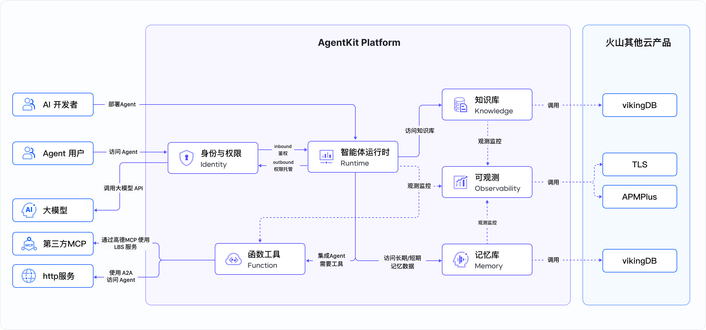
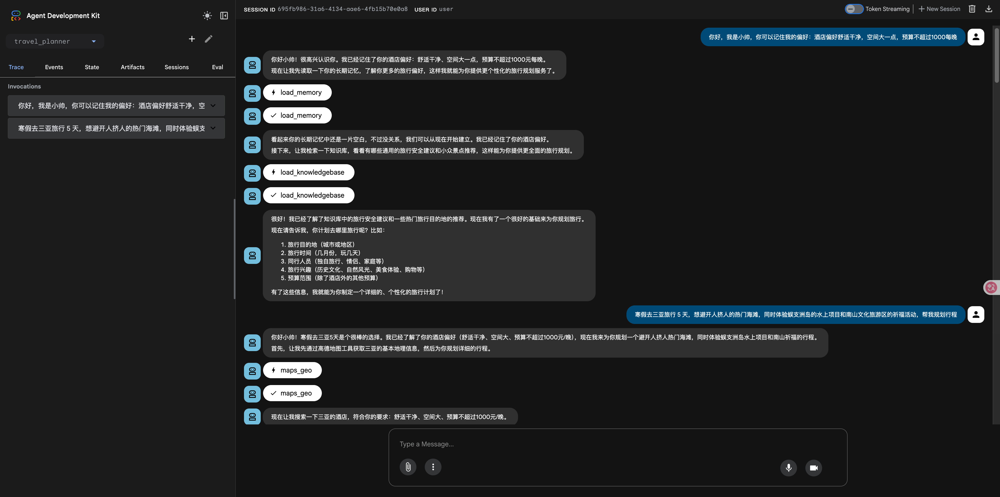
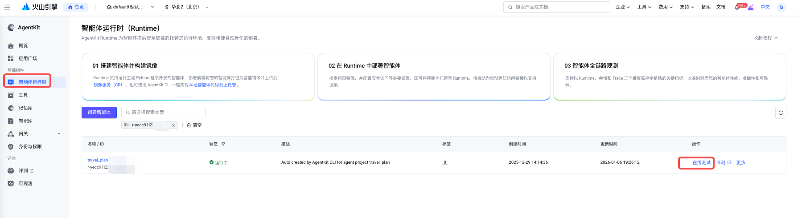
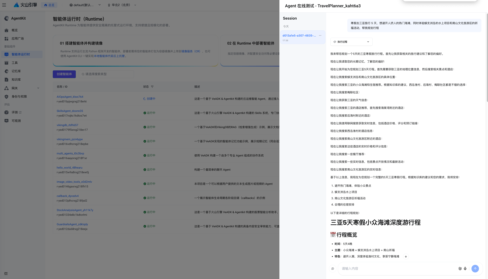
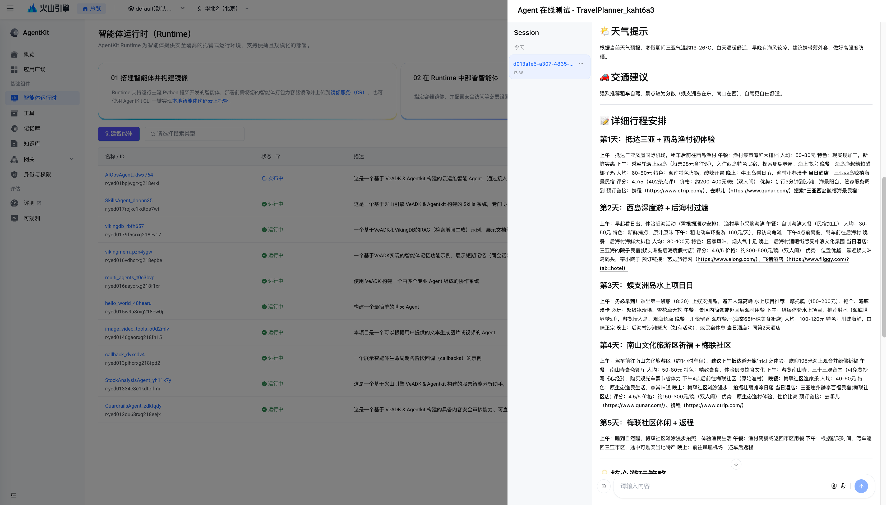

# 智能旅行助手

## 概述

这是一个基于火山引擎VeADK&AgentKit构建的智能旅行规划智能体。本智能体集成第三方 MCP（高德）服务以获取 LBS 地理位置信息并规划行程路线；内置由 VikingDB 构建的知识库，可提供通用旅行安全建议及小众景点推荐；接入 Web Search 基础联网搜索工具，增强智能体实时信息搜索能力；通过记忆库记录用户偏好，为用户提供个性化服务体验。

## 核心功能

本项目提供以下核心功能：

- 行程规划：调用三方MCP Tool(高德) 生成详细行程安排，包括交通、餐饮、住宿推荐及景点游览。
- 实时信息查询：调用web search联网搜索，查询实时信息（如天气、景点开发时段、票务预订），确保用户行程顺利。
- 旅行知识库：内置旅行相关的知识库，提供小众景点推荐及实用旅行建议。
- 个性化推荐：基于记忆库记录的用户历史偏好和旅行习惯，为用户提供个性化推荐。

## Agent 能力



```text
用户消息
    ↓
AgentKit 运行时
    ↓
旅行助手智能体
    ├── 旅行知识库
    ├── 长期记忆库
    ├── MCP Tool（高德）
    └── web search 工具
```

主要的火山引擎产品或 Agent 组件：

- 方舟大模型：
  - deepseek-v4-pro-260425
- VikingDB 知识库
- VikingDB 记忆库
- TOS 存储服务
- Web Search 联网搜索
- AgentKit
- Identity
- APMPlus

## 目录结构说明

```bash
├── README.md # 项目说明
├── __init__.py # 初始化文件
├── agent.py  # Agent应用入口
├── client.py # Agent客户端
├── knowledgebase_docs # 知识库文档
│   ├── tourists_recommend.md
│   └── general_safety_guide.md
└── requirements.txt  # 依赖包列表
```

## 本地运行

### 前置准备

**1. Python版本：**

- Python 3.12 或更高版本

**2. 开通火山方舟模型服务：**

- 访问 [火山方舟控制台](https://exp.volcengine.com/ark?mode=chat)
- 开通模型服务

**3. 获取火山引擎访问凭证：**

- 参考 [用户指南](https://www.volcengine.com/docs/6291/65568?lang=zh) 获取 AK/SK

**4. 获取高德 MCP 服务访问凭证：**

- 注册并登录 [高德开放平台](https://lbs.amap.com/)
- 参考 [创建应用并获取 Key](https://amap.apifox.cn/doc-537183) 获取高德MCP服务的 Key，在后续环境变量 `GAODE_MCP_API_KEY`中填入该 Key。

> 注意：绑定的服务为“web服务API”

**5. 创建或导入知识库：**

- 参考 [AgentKit 知识库指南](https://www.volcengine.com/docs/86681/1865671) 创建或导入知识库

**6. 创建或导入记忆库：**

- 参考 [AgentKit 创建记忆库](https://www.volcengine.com/docs/86681/1844843) 新建记忆库
- 参考 [AgentKit 导入记忆库](https://www.volcengine.com/docs/86681/2205109) 导入已有记忆库

### 依赖安装

#### 1. 安装 uv 包管理器

```bash
# macOS / Linux（官方安装脚本）
curl -LsSf https://astral.sh/uv/install.sh | sh

# 或使用 Homebrew（macOS）
brew install uv
```

#### 2. 初始化项目依赖

```bash
# 进入项目目录
cd python/02-use-cases/travel_planner
```

您可以通过 `pip` 工具来安装本项目依赖：

```bash
pip install -r requirements.txt
```

或者使用 `uv` 工具来安装本项目依赖(推荐)：

```bash
# 如果没有 `uv` 虚拟环境，可以使用命令先创建一个虚拟环境
uv venv --python 3.12

# 使用 `pyproject.toml` 管理依赖
uv sync --index-url https://pypi.tuna.tsinghua.edu.cn/simple

# 使用 `requirements.txt` 管理依赖
uv pip install -r requirements.txt

# 激活虚拟环境
source .venv/bin/activate
```

### 环境准备

设置以下环境变量:

```bash
# 火山方舟模型名称 (可选，默认使用 deepseek-v4-pro-260425)
export MODEL_AGENT_NAME=<Your Ark Model Name>

# 火山引擎访问凭证（必需）
export VOLCENGINE_ACCESS_KEY=<Your Access Key>
export VOLCENGINE_SECRET_KEY=<Your Secret Key>

# 高德MCP服务访问凭证（必需）
export GAODE_MCP_API_KEY=<Your Gaode MCP API Key>

# 火山VikingDB知识库名称（必需）
export DATABASE_VIKING_COLLECTION=<Your VikingDB Knowledge Collection Name>

# 长期记忆相关环境变量（默认支持两种后端：VikingDB和Mem0，用户根据需要任选一种即可）
## 选择VikingDB作为长期记忆后端时需要配置以下环境变量
export DATABASE_VIKINGMEM_COLLECTION=<your_vikingdb_memory_collection_name>
export DATABASE_VIKINGMEM_MEMORY_TYPE=<your_vikingdb_memory_type>
## 选择Mem0作为长期记忆后端时需要配置以下环境变量
export DATABASE_MEM0_BASE_URL=<your_mem0_base_url>
export DATABASE_MEM0_API_KEY=<your_mem0_api_key>

# TOS桶名称（必需，知识库初始化时使用）
export DATABASE_TOS_BUCKET=<Your Tos Bucket Name>
export DATABASE_TOS_REGION=<Your Tos Region>
```

### 调试方法

使用 `veadk web` 进行本地调试:

```bash
# 进入 02-use-cases 目录
cd agentkit-samples/02-use-cases

# 启动 VeADK Web 界面
veadk web --port 8080

# 在浏览器访问：http://127.0.0.1:8080
```

Web 界面提供图形化对话测试环境，支持实时查看消息流和调试信息。

### 示例提示词

```text
寒假去三亚旅行 5 天，想避开人挤人的热门海滩，同时体验蜈支洲岛的水上项目和南山文化旅游区的祈福活动，帮我规划行程
清明假期去杭州旅行 3 天，除了西湖、灵隐寺这些必去景点，还想加 1 天西溪国家湿地公园的徒步，，该怎么规划每日行程才不赶？
五一假期去成都玩 3 天，想打卡宽窄巷子、大熊猫繁育研究基地，还想安排 1 天周边游（比如都江堰或青城山），行程该怎么合理分配？
重阳节带父母去北京旅行 6 天，想参观故宫、天坛等适合长辈的文化景点，还想安排颐和园的休闲漫步，如何规划节奏舒缓的行程？
元旦去哈尔滨旅行，帮我规划下5天4晚的行程，既能兼顾冰雪大世界、中央大街等热门景点，又能体验东北特色美食
```

### 效果展示



## AgentKit 部署

### 前置准备

**重要提示**：在运行本示例之前，请先访问 [AgentKit 控制台授权页面](https://console.volcengine.com/agentkit/region:agentkit+cn-beijing/auth?projectName=default) 对所有依赖服务进行授权，确保案例能够正常执行。

参考 本地运行 部分的 前置准备。

### 依赖安装

> 如果您本地已经安装了该依赖，跳过此步骤。

使用 `pip` 安装 AgentKit 命令行工具：

```bash
pip install agentkit-sdk-python==0.3.2
```

或者使用 `uv` 安装 AgentKit 命令行工具：

```bash
uv pip install agentkit-sdk-python==0.3.2
```

### 设置环境变量

```bash
# 火山引擎访问凭证（必需）
export VOLCENGINE_ACCESS_KEY=<Your Access Key>
export VOLCENGINE_SECRET_KEY=<Your Secret Key>
```

### AgentKit 云上部署

```bash
# 1. 进入项目目录
cd python/02-use-cases/travel_planner

# 2. 配置 Agentkit 部署配置
agentkit config \
--agent_name travel_planner_advanced \
--entry_point 'agent.py' \
--launch_type cloud

# 3. 配置 AgentKit Runtime 环境变量（应用级）
# 以下环境变量均为必填项，参考 前置准备 部分获取相应的值
agentkit config \
-e GAODE_MCP_API_KEY=<Your Gaode MCP API Key> \
-e DATABASE_VIKING_COLLECTION=<Your VikingDB Knowledge Collection Name> \
-e DATABASE_VIKINGMEM_COLLECTION=<Your VikingDB Memory Collection Name> \
-e DATABASE_TOS_BUCKET=<Your Tos Bucket Name> \
-e DATABASE_TOS_REGION=<Your Tos Region>

# 4. 启动云端服务
agentkit launch

# 5. 测试部署的 Agent
agentkit invoke "你好"

```

### 测试已部署的智能体

在AgentKit控制台 智能体运行时 页面找到已部署的智能体 `travel_planner_advanced`，点击在线测评，输入提示词进行测试。


或者使用 client.py 连接云端服务进行测试：

```bash
# 需要编辑 client.py，将其中的第 15 行和第 16 行的 base_url 和 api_key 修改为 agentkit.yaml 中生成的 runtime_endpoint 和 runtime_apikey 字段
python client.py
```

## 示例提示词

```text
寒假去三亚旅行 5 天，想避开人挤人的热门海滩，同时体验蜈支洲岛的水上项目和南山文化旅游区的祈福活动，帮我规划行程
清明假期去杭州旅行 3 天，除了西湖、灵隐寺这些必去景点，还想加 1 天西溪国家湿地公园的徒步，，该怎么规划每日行程才不赶？
五一假期去成都玩 3 天，想打卡宽窄巷子、大熊猫繁育研究基地，还想安排 1 天周边游（比如都江堰或青城山），行程该怎么合理分配？
重阳节带父母去北京旅行 6 天，想参观故宫、天坛等适合长辈的文化景点，还想安排颐和园的休闲漫步，如何规划节奏舒缓的行程？
我计划去哈尔滨旅行，帮我规划下5天4晚的行程，既能兼顾冰雪大世界、中央大街等热门景点，又能体验东北特色美食
```

## 效果展示




## 常见问题

无

## 参考资料

- [VeADK 官方文档](https://volcengine.github.io/veadk-python/)
- [AgentKit 开发指南](https://volcengine.github.io/agentkit-sdk-python/)
- [火山方舟模型服务](https://console.volcengine.com/ark/region:ark+cn-beijing/overview?briefPage=0&briefType=introduce&type=new&projectName=default)

## 代码许可

本工程遵循 Apache 2.0 License
